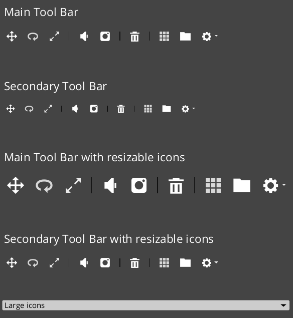
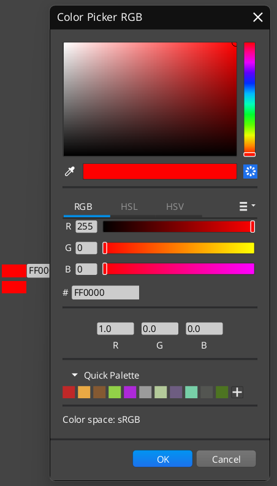

# AzQt GUI Framework

AzQt is a user interface framwork to easily create user interfaces like Blender and [O3DE](https://o3de.org).

Note that this project is extracted and extended from the awesome 3D development libraray that Amazon owned opne Source project [O3DE](https://o3de.org)

Note that this project will detached as much as possible from the O3DE library and provide a standalone framework for those who want to create applications rather than a game engine. Besides it will add such applications as showcase without or with minimum functionality.

## Installation

The project will serve both Visual Studio projects as well as CMake project

### VcPkg

To keep dependency management minimum [vcpkg](https://vcpkg.io/en/) is used with the following dependencies;

- Qt

``` sh
git clone https://github.com/Microsoft/vcpkg.git
---------------------------------------
.\vcpkg\bootstrap-vcpkg.bat # windows
----------------------------------------
./vcpkg/bootstrap-vcpkg.sh # Unix
```

### Platforms

Windows, Linux and Mac Support will be provided.

## Screenshots







